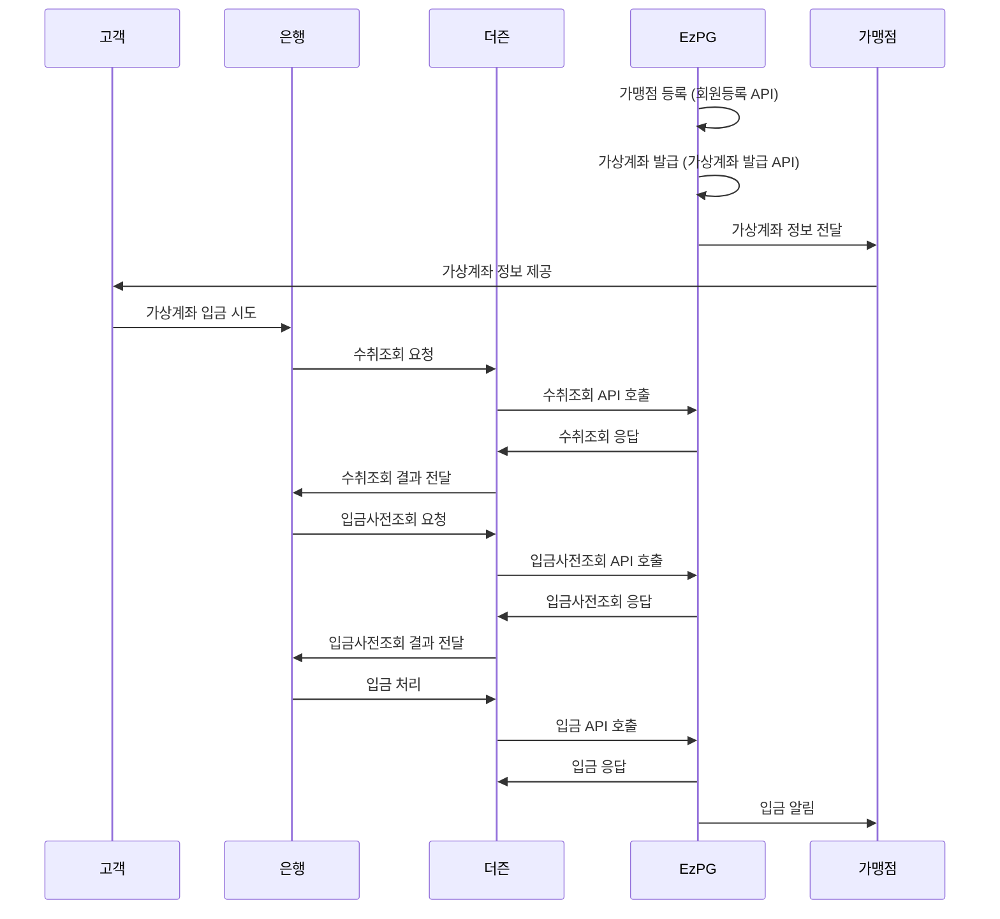
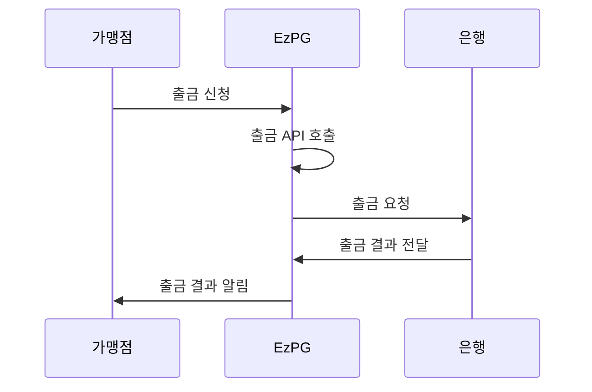
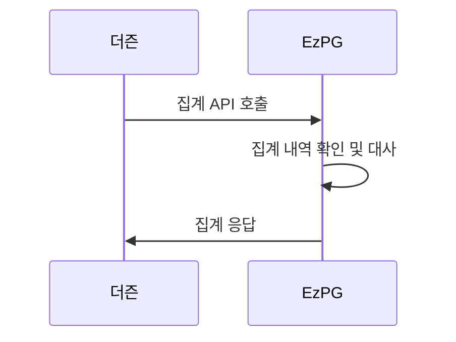

# EzPG API 통합 가이드

## 목차

1. [개요](#1-개요)
2. [관리자 메뉴별 API 구성](#2-관리자-메뉴별-api-구성)
3. [API 호출 흐름](#3-api-호출-흐름)
4. [API 연동 시 주의사항](#4-api-연동-시-주의사항)
5. [추가 필요 API](#5-추가-필요-api)

## 1. 개요

본 문서는 EzPG 전자결제 시스템의 관리자 페이지 메뉴 구성에 맞춰 필요한 API를 정리하고, 각 API의 호출 순서와 입출력 파라미터를 설명합니다. 이 문서는 기존 API 문서와 함께 참조하여 사용해야 합니다.

### 1.1 참조 문서

- `docs/api/user-registration.md`: 회원등록 API 문서
- `docs/api/withdrawal.md`: 출금 API 문서
- `docs/api/additional-apis.md`: 추가 API 문서
- `etc/api-processing-guide.md`: API 처리 기준 문서

## 2. 관리자 메뉴별 API 구성

EzPG 관리자 페이지의 메뉴 구성에 맞춰 필요한 API를 분류하였습니다.

### 2.1 로그인/인증 관련 API

| API 명       | 설명          | 문서 위치                   | 구현 상태 |
| ------------ | ------------- | --------------------------- | --------- |
| 로그인 API   | 사용자 인증   | docs/api/additional-apis.md | 구현 완료 |
| OTP 인증 API | 구글 OTP 인증 | docs/api/additional-apis.md | 구현 완료 |

### 2.2 대시보드 관련 API

| API 명               | 설명                       | 문서 위치                   | 구현 상태 |
| -------------------- | -------------------------- | --------------------------- | --------- |
| 가맹점 잔액 조회 API | 가맹점별 총 합산 잔액 조회 | docs/api/additional-apis.md | 구현 완료 |
| 최근 거래 내역 API   | 최근 거래 내역 조회        | docs/api/additional-apis.md | 구현 완료 |

### 2.3 가맹점 관리 관련 API

| API 명               | 설명                  | 문서 위치                     | 구현 상태 |
| -------------------- | --------------------- | ----------------------------- | --------- |
| 가맹점 등록 API      | 가맹점 정보 등록      | docs/api/user-registration.md | 구현 완료 |
| 가맹점 목록 조회 API | 가맹점 목록 조회      | docs/api/additional-apis.md   | 구현 완료 |
| 가맹점 설정 API      | 가맹점 설정 정보 관리 | docs/api/additional-apis.md   | 구현 완료 |

### 2.4 거래 관리 관련 API

| API 명             | 설명                     | 문서 위치                   | 구현 상태 |
| ------------------ | ------------------------ | --------------------------- | --------- |
| 입금 내역 조회 API | 입금 거래 내역 조회      | docs/api/additional-apis.md | 구현 완료 |
| 출금 내역 조회 API | 출금 거래 내역 조회      | docs/api/additional-apis.md | 구현 완료 |
| 출금 API           | 출금 처리                | docs/api/withdrawal.md      | 구현 완료 |
| 수취조회 API       | 입금 전 계좌 유효성 확인 | etc/api-processing-guide.md | 구현 필요 |
| 입금사전조회 API   | 입금 전 사전 확인        | etc/api-processing-guide.md | 구현 필요 |
| 입금 API           | 입금 처리                | etc/api-processing-guide.md | 구현 필요 |
| 입금정정 API       | 입금 취소/정정 처리      | etc/api-processing-guide.md | 구현 필요 |
| 집계 API           | 거래 집계 정보           | etc/api-processing-guide.md | 구현 필요 |

### 2.5 가상계좌 관리 관련 API

| API 명                   | 설명                 | 문서 위치                   | 구현 상태 |
| ------------------------ | -------------------- | --------------------------- | --------- |
| 가상계좌 발급 API        | 가상계좌 발급        | docs/api/additional-apis.md | 구현 완료 |
| 가상계좌 입금 테스트 API | 가상계좌 입금 테스트 | docs/api/additional-apis.md | 구현 완료 |

### 2.6 설정 관련 API

| API 명          | 설명             | 문서 위치 | 구현 상태      |
| --------------- | ---------------- | --------- | -------------- |
| 시스템 설정 API | 시스템 설정 관리 | -         | 추가 정의 필요 |
| 알림 설정 API   | 알림 설정 관리   | -         | 추가 정의 필요 |

## 3. API 호출 흐름

### 3.1 가상계좌 발급 및 입금 처리 흐름

1. 가맹점 등록 (회원등록 API)
2. 가상계좌 발급 (가상계좌 발급 API)
3. 고객의 가상계좌 입금 시도
4. 수취조회 API 호출 (은행 → 더즌 → EzPG)
5. 입금사전조회 API 호출 (은행 → 더즌 → EzPG)
6. 입금 API 호출 (은행 → 더즌 → EzPG)
7. 입금 내역 조회 API를 통한 입금 확인

### 3.2 출금 처리 흐름

1. 출금 신청 (출금 API)
2. 출금 내역 조회 API를 통한 출금 확인

### 3.3 정산 처리 흐름

1. 집계 API 호출 (더즌 → EzPG)
2. 집계 내역 확인 및 대사

## 4. API 연동 시 주의사항

1. **보안**

   - 모든 API 호출은 HTTPS를 통해 이루어져야 합니다.
   - 인증이 필요한 API는 요청 헤더에 JWT 토큰을 포함해야 합니다.
   - 민감한 정보는 암호화하여 전송해야 합니다.

2. **성능**

   - API 호출 횟수 제한을 통해 DDoS 공격을 방지해야 합니다.
   - 대량 데이터 조회 시 페이징 처리를 활용해야 합니다.

3. **오류 처리**

   - 오류 발생 시 적절한 로깅 및 알림 처리가 필요합니다.
   - 재시도 메커니즘을 구현해야 합니다.

4. **입금 처리 관련**

   - 입금사전거래 전문의 TIMEOUT 시간은 10초이며 무응답 시 은행으로 오류를 더즌에서 응답 처리하며 입금은 처리되지 않습니다.
   - 입금 API는 통보성으로 전송하며, 입금 API에 대하여 무응답 시 10분 주기로 더즌에서 기관으로 재전송합니다.
   - 실입금자명 사용 기관의 경우, 실입금자명 처리 이후에 입금전문을 발송합니다.

5. **가상계좌 입금처리 업무시간**
   - 은행별로 업무처리시간은 다르며 일반적으로 00:30 ~ 23:30 거래가 가능합니다.
   - 은행은 정기적으로 점검일자를 가지며 해당 일자의 거래 개시 기간이 늦어질 수 있습니다.

## 5. 추가 필요 API

현재 문서에 정의된 API 외에 EzPG 전자결제 시스템 구현을 위해 추가로 필요한 API는 다음과 같습니다:

### 5.1 시스템 설정 API

- **목적**: 시스템 전반의 설정을 관리
- **주요 기능**:
  - 시스템 환경 설정 관리
  - 보안 설정 관리
  - 로그 설정 관리
- **구현 상태**: 추가 정의 필요

### 5.2 알림 설정 API

- **목적**: 텔레그램 알림 등 알림 설정을 관리
- **주요 기능**:
  - 텔레그램 봇 연동 설정
  - 알림 조건 설정
  - 알림 대상 설정
- **구현 상태**: 추가 정의 필요

### 5.3 통계 API

- **목적**: 거래 통계 정보를 제공
- **주요 기능**:
  - 기간별 거래 통계
  - 가맹점별 거래 통계
  - 수수료 통계
- **구현 상태**: 추가 정의 필요

### 5.4 로그 관리 API

- **목적**: 시스템 로그 관리
- **주요 기능**:
  - 로그 조회
  - 로그 레벨 설정
  - 로그 보관 기간 설정
- **구현 상태**: 추가 정의 필요
